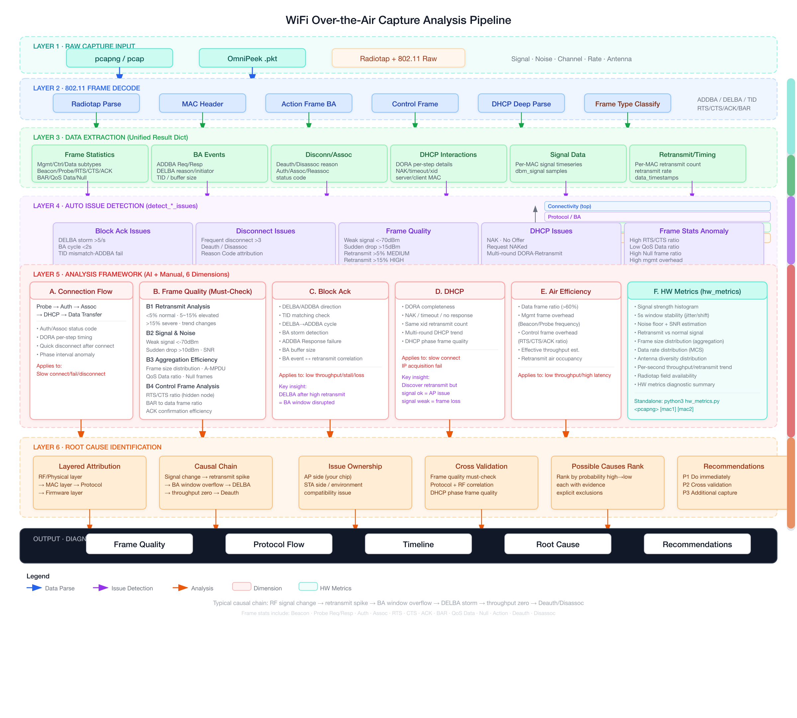

# WiFi Analyzer — AI-Powered WiFi Packet Capture Analysis Tool

One-click WiFi over-the-air capture analysis with automatic root cause diagnosis.

Feed pcapng/OmniPeek capture files to AI, and it performs the complete analysis from data extraction to root cause identification: frame quality assessment, protocol flow analysis, timeline reconstruction, causal chain building, and troubleshooting recommendations.

## Quick Start

### 1. Clone the Project

```bash
git clone https://github.com/yourname/wifi-analyzer.git
cd wifi-analyzer
```

### 2. Configure API Key

Choose one method:

```bash
# Method 1: Environment variable
export WIFI_ANALYZER_API_KEY="sk-your-api-key"

# Method 2: Config file
cat > ~/.wifi_analyzer.json << 'EOF'
{
  "api_key": "sk-your-api-key",
  "base_url": "https://api.openai.com",
  "model": "gpt-4o"
}
EOF
```

### 3. Prepare Capture

Create a directory with capture files and problem description:

```bash
mkdir my_case
cp capture.pcapng my_case/
# Edit problem description (template in templates/问题描述模板.md)
```

### 4. Run Analysis

```bash
python3 wifi_analyzer.py my_case
```

AI will output a complete diagnosis report including: frame quality assessment, protocol flow analysis, timeline reconstruction, root cause identification, and troubleshooting recommendations.

## Supported AI Providers

| Provider | base_url | Example Models |
|----------|----------|----------------|
| OpenAI | `https://api.openai.com` | `gpt-4o`, `gpt-4o-mini` |
| Claude | `https://api.anthropic.com` | `claude-sonnet-4-20250514`, `claude-haiku-4-5-20251001` |
| DeepSeek | `https://api.deepseek.com` | `deepseek-chat` |
| Ollama (local) | `http://localhost:11434` | `llama3`, `qwen2` |
| vLLM | `http://localhost:8000` | Depends on loaded model |
| Any OpenAI-compatible | Corresponding URL | Corresponding model |

> When Anthropic URL or `claude`-prefixed model name is set, Anthropic API is used automatically; otherwise OpenAI-compatible format is used.

## Configuration

### Priority

CLI args > Environment variables > Config file (`~/.wifi_analyzer.json`)

### Environment Variables

| Variable | Description |
|----------|-------------|
| `WIFI_ANALYZER_API_KEY` | API key |
| `WIFI_ANALYZER_BASE_URL` | API endpoint |
| `WIFI_ANALYZER_MODEL` | Model name |
| `WIFI_ANALYZER_PROVIDER` | `openai` or `anthropic` |

### Config File

`~/.wifi_analyzer.json`:

```json
{
  "api_key": "sk-xxx",
  "base_url": "https://api.openai.com",
  "model": "gpt-4o",
  "max_tokens": 8192,
  "temperature": 0.3
}
```

## Command Reference

```bash
# Basic analysis
python3 wifi_analyzer.py <directory>

# Specify API key and model
python3 wifi_analyzer.py <directory> --api-key sk-xxx --model gpt-4o

# Use DeepSeek
python3 wifi_analyzer.py <directory> --base-url https://api.deepseek.com --model deepseek-chat

# Use local Ollama
python3 wifi_analyzer.py <directory> --base-url http://localhost:11434 --model llama3

# Save report to file
python3 wifi_analyzer.py <directory> --save-report report.md

# Extract data only, no AI call
python3 wifi_analyzer.py <directory> --extract-only --save-report extracted.md

# Filter by MAC and time range
python3 wifi_analyzer.py <directory> --mac AA:BB:CC:DD:EE:FF --from 10 --to 60

# Filter by event type
python3 wifi_analyzer.py <directory> --type ba
```

## Problem Description Template

Before analysis, fill in `问题描述.md` (template in `templates/问题描述模板.md`). Must include:

- **Problem Overview** — One-sentence description of the symptom
- **Key MAC Addresses** — AP and STA MACs
- **Capture Details** — Tool, location, duration

Optional but recommended: test environment, test scenario, reproduction steps, known clues.

## Data Analysis Pipeline



The analysis pipeline has 6 layers, from raw capture to root cause identification:

| Layer | Description | Key Content |
|-------|-------------|-------------|
| **L1 Raw Capture** | pcapng / pcap / OmniPeek .pkt | Contains Radiotap headers (signal, noise, channel, rate, antenna) |
| **L2 Frame Decode** | 802.11 MAC Header + Control + DHCP | Radiotap parsing, MAC frames, BA Action, **RTS/CTS/ACK/BAR**, DHCP Deep Parse |
| **L3 Data Extraction** | Unified Result Dict | Frame statistics (all subtypes), BA events, disconnect/assoc, DHCP interactions, signal data, retransmit stats |
| **L4 Auto Detection** | `detect_*_issues()` automatic anomaly detection | BA storm/cycle, frequent disconnection, weak signal/high retransmit, DHCP NAK/multi-round |
| **L5 Analysis Framework** | AI + Manual 6-dimension analysis | A.Connection Flow B.Frame Quality (must-check: retransmit/signal/aggregation/**control frames RTS-CTS-ACK**) C.Block Ack D.DHCP E.Air Efficiency **F.Hardware Metrics** |
| **L6 Root Cause** | Cross-layer causal chain reconstruction | Layered attribution, causal chain building, cross-validation, issue attribution, troubleshooting recommendations |

### Analysis Dimensions Overview

| Dimension | Analysis Content | Data Source |
|-----------|------------------|-------------|
| **Frame Statistics** | Beacon/Probe/Auth/Assoc/RTS/CTS/ACK/BAR/QoS Data/Null/Action/Deauth/Disassoc all subtype counts and ratios | analyze.py |
| **Retransmit Analysis** | Per-MAC retransmit rate, trend changes, time correlation with BA/disconnect events | analyze.py |
| **Signal & Noise** | Per-MAC signal time series, avg/min/max, sudden drop detection, SNR estimation | analyze.py + hw_metrics.py |
| **Frame Size & Aggregation** | A-MPDU/A-MSDU aggregation efficiency, large/small frame ratio | hw_metrics.py |
| **Control Frame Analysis** | RTS/CTS ratio (hidden node detection), BAR to data frame ratio, ACK efficiency | analyze.py |
| **Block Ack** | ADDBA/DELBA direction, TID matching, BA cycle/storm, buffer size | analyze.py |
| **Disconnect/Assoc** | Deauth/Disassoc reason code, Auth/Assoc status code | analyze.py |
| **DHCP** | DORA completeness, NAK/timeout/no response, multi-round interaction, per-step timing | analyze.py |
| **Air Efficiency** | Data frame ratio, management/control frame overhead, effective throughput estimation | analyze.py |
| **Hardware Metrics** | Signal histogram, 5-second window stability, noise floor, retransmit frame signal comparison, rate distribution, antenna distribution, per-second trend | hw_metrics.py |

### Auto Detection Thresholds

| Detection | Condition | Severity |
|-----------|-----------|----------|
| BA Storm | >5 DELBAs in 1 second | HIGH |
| BA Cycle | DELBA→ADDBA interval <2s, ≥3 times | HIGH |
| ADDBA Failure | ADDBA Response returns failure status | MEDIUM |
| TID Mismatch | DELBA and ADDBA TID inconsistency | MEDIUM |
| Frequent Disconnect | Deauth + Disassociation >3 times | HIGH |
| Weak Signal | < -70 dBm | MEDIUM |
| Signal Sudden Drop | Drop >15 dBm | INFO |
| High Retransmit Rate | >15% HIGH, 5%~15% MEDIUM | HIGH/MEDIUM |
| DHCP NAK | AP rejects IP allocation | HIGH/MEDIUM |
| DHCP No Response | Discover without Offer | HIGH |
| DHCP Multi-round | >1 round of DORA interaction | HIGH |

### Typical Causal Chain

```
Signal sudden change → Retransmit spike → BA window overflow → DELBA → Throughput zero → Deauth
```

### Code Architecture

```
wifi_analyzer.py          CLI entry point, orchestrates the entire flow
  ├── pcapng_parser.py    pcapng binary parser
  ├── omnipeek_parser.py  OmniPeek .pkt parser
  ├── analyze.py          Data extraction + issue detection + report generation
  ├── hw_metrics.py       Hardware metrics deep analysis (signal/noise/frame size/antenna/rate)
  ├── prompt_builder.py   Analysis methodology + prompt construction
  └── llm_client.py       Universal LLM API client
```

### Supported Capture Formats

- pcapng (Wireshark, tcpdump)
- pcap
- OmniPeek / AiroPeek .pkt

## Standalone Data Extraction

Data extraction works without AI:

```bash
# Terminal output (with colors)
python3 analyze.py <directory>

# Generate Markdown report
python3 analyze.py <directory> --report report.md

# Filter by MAC
python3 analyze.py <file> --mac AA:BB:CC:DD:EE:FF --report filtered.md
```

## Hardware Metrics Deep Analysis

`hw_metrics.py` extracts radiotap-layer hardware diagnostic data from pcapng captures for RF-layer issue identification:

```bash
# Analyze all MACs
python3 hw_metrics.py capture.pcapng

# Analyze specific MACs only
python3 hw_metrics.py capture.pcapng AA:BB:CC:DD:EE:FF
```

Analysis dimensions include: signal strength distribution, 5-second window stability, noise floor, SNR estimation, retransmit frame vs normal frame signal comparison, frame size distribution (aggregation efficiency), data rate distribution, antenna distribution, per-second throughput and retransmit trend, and automatic diagnostic summary.

## Pure Python, Zero Dependencies

All code uses only Python standard library. No third-party packages required. Python 3.10+.

## License

MIT
